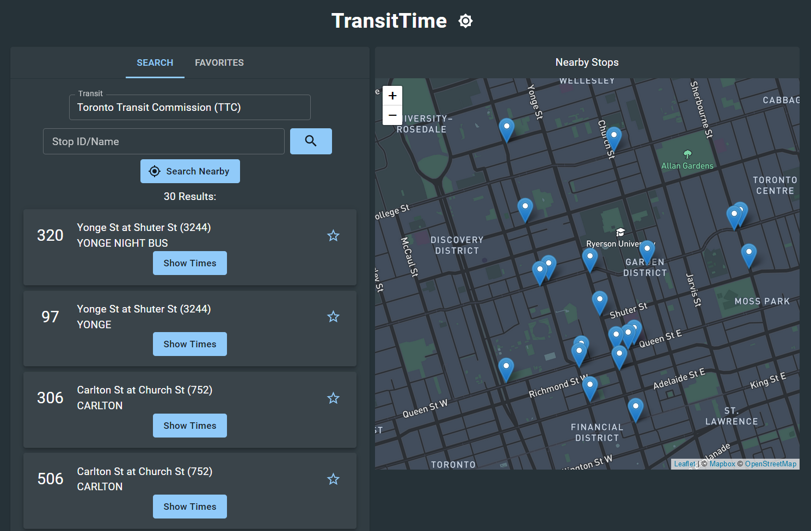
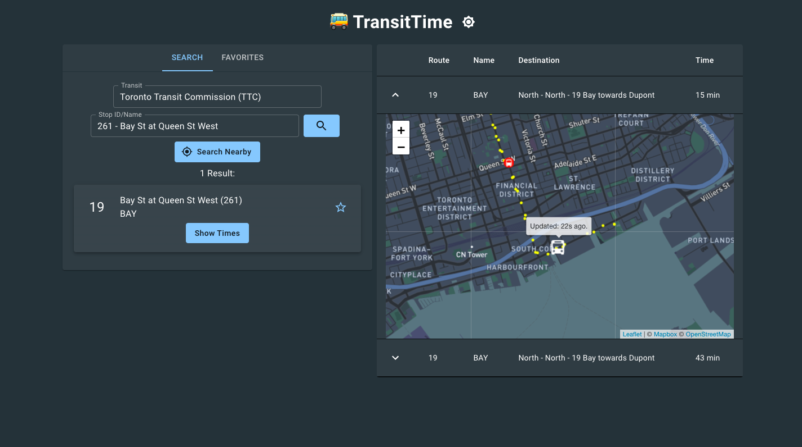

# TransitTime - Real-time transit updates

TransitTime is a web app where you can look up transit data such as stop information, arrival predictions, and bus location.

**DEMO:** https://transit-time.netlify.app/

## Supported Transit Agencies

- Edmonton Transit Service
- Toronto Transit Commission

## Project Setup

- Clone this repo
- Install dependencies with `npm install` in both [server](/server) and [client](/client) folders.
- Make an ENV file for both server and client using [.env.example](/server/.env.example) and fill in the fields with your database url and API keys.
- In the server folder, use `npm start` to run the server.
- In the client folder, use `npm start` to run the client.
